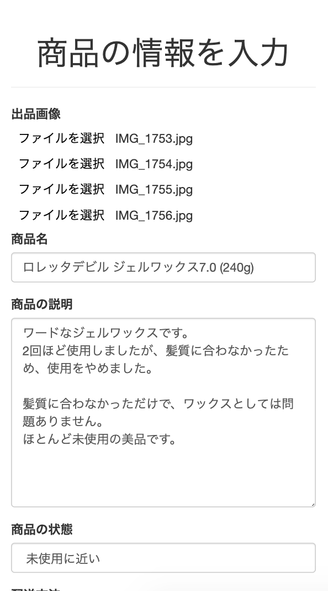
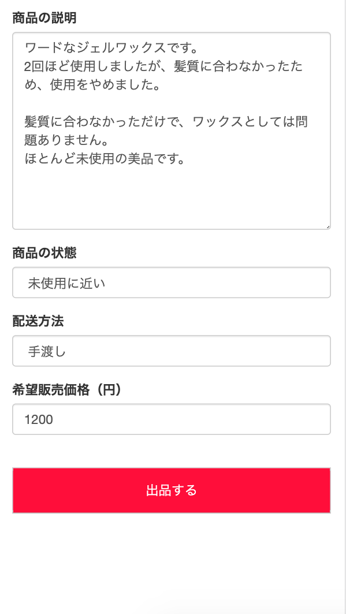
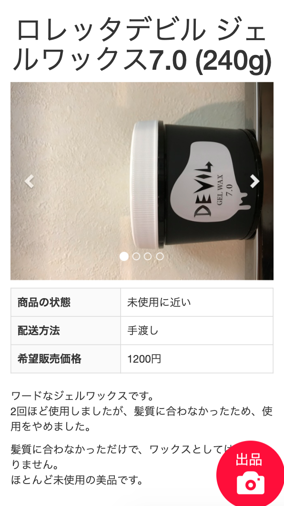
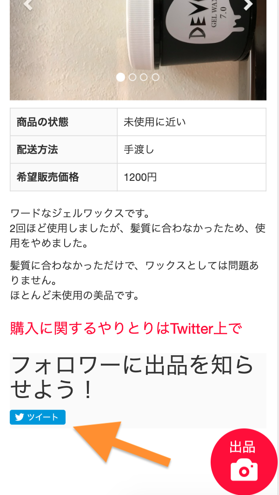

# うるとも
このサービスは、「知り合いに中古品を売りたい」という需要を満たすため、値段や写真などの出品情報をtwitterに共有することができるサービスです。  
知り合いに売る方が、他人に売るよりも送料や信頼の面でメリットが大きいため、SNSを通じて知り合いに売れるサービスを作成しました。

## 機能
### 出品機能
#### 商品情報入力ページ
出品ページに表示する内容は、商品情報入力ページ( https://xxxxx/items/new )で入力します。  
<kbd></kbd>  
 
必要な情報を入力し、出品ボタンを押すと、出品ページが作成されます。  
 
<kbd></kbd>

#### 出品ページ
<kbd></kbd>  
 
作成された出品ページは、URLの末尾にランダムな20文字の文字列が付与されます。  
例) https://xxxxx/items/8f0e6f4f71b54d41d0ab  
このため、基本的に出品ページのURLを知らないと、このページにたどり着くことが難しい設計になっています。  

### Twitter共有機能
出品者にはTwitter共有ボタンが表示されるため、このボタンからTwitterで出品ページを共有できます。  
<kbd></kbd>
